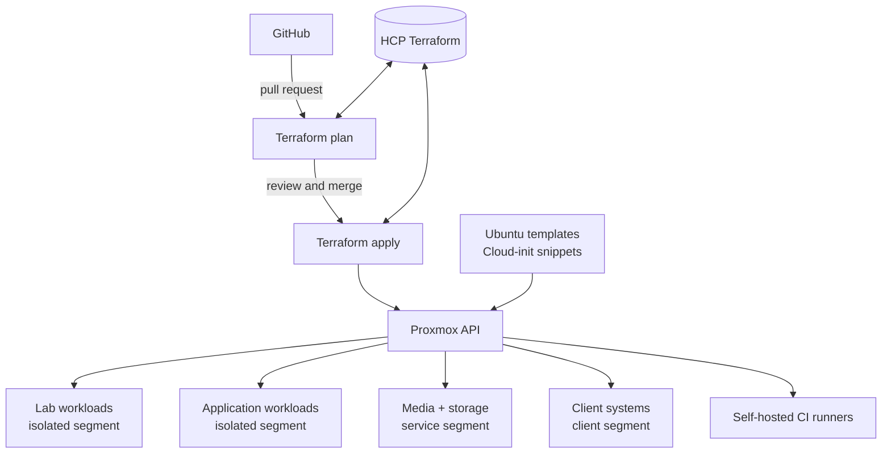
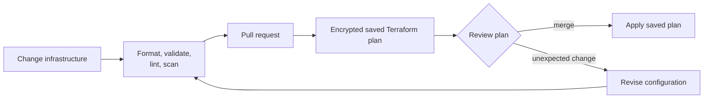

# HomeLab

[](terraform/)
[](https://www.proxmox.com/en/products/proxmox-virtual-environment/overview)
[](https://github.com/krakenhavoc/HomeLab/actions/workflows/pre-commit.yaml)
[](LICENSE)

Production homelab infrastructure, kept as code.

This repository is both the source of truth for services I run at home and a record of how I approach infrastructure engineering: small reusable modules, repeatable builds, reviewable plans, segmented networks, and runbooks written for the person responding to a problem at 2 a.m.

## What this lab demonstrates

| Area | Implementation |
| --- | --- |
| Infrastructure as code | Terraform modules and environment-specific deployments |
| Virtualization | Proxmox VE virtual machines, containers, templates, and images |
| Provisioning | Cloud-init templates for first-boot configuration |
| Delivery | GitHub Actions plans pull requests and applies merged changes |
| State | HCP Terraform workspaces separated by deployment |
| Networking | VLAN-separated lab, application, service, and client workloads |
| Workloads | Internal gateway, private applications, media services, NFS, lab systems, and self-hosted runners |
| Guardrails | Pre-commit checks, module tests, saved plans, and deliberate replacement workflows |

## Architecture at a glance



The Proxmox host provides compute and storage. Terraform describes each workload as a separate deployment, cloud-init handles first boot, and reusable GitHub Actions workflows keep planning and applying consistent. More detail lives in the [architecture overview](docs/overview.md).

## Deployed stacks

| Deployment | What it manages | Delivery |
| --- | --- | --- |
| `lab` | OpenClaw hosts, a CTF workstation, and a Windows 11 VM | Plan on PR, apply after merge |
| `cmd-and-ctrl` | Development and production game servers, ingress, and off-node backup buckets | Plan on PR, apply after merge |
| `frontends` | The internal Caddy/Homepage gateway and private frontends | Plan on PR, apply after merge |
| `lastdash` | A stateful application host with repository-driven runtime configuration | Plan on PR, apply after merge |
| `plex` | Development and production Plex hosts backed by NFS storage | Plan on PR, apply after merge |
| `nfs` | Development and production NFS containers | Plan on PR, apply after merge |
| `shared` | Ubuntu container templates, VirtIO drivers, and installation media | Plan on PR, apply after merge |
| `gh-runner` | Controller and worker VMs for self-hosted GitHub Actions | Manual, dry-run by default |
| `tfc` | HCP Terraform projects and workspaces used by the deployment roots | Dedicated workflow |

The repository also retains earlier Kubernetes bootstrap scripts and space for future Ansible, monitoring, and backup automation. Those areas are labeled as such instead of being presented as deployed infrastructure.

## Repository map

```text
.
├── .github/workflows/       Reusable CI/CD and deployment workflows
├── ansible/                 Reserved configuration-management workspace
├── diagrams/                Diagram conventions and architecture views
├── gateway/                 Internal proxy and portal configuration
├── lastdash/                LastDash runtime configuration
├── docker/get-win-url/      Small containerized Windows media helper
├── docs/                    Architecture, operations, security, and recovery
├── scripts/                 Bootstrap and maintenance utilities
└── terraform/
    ├── deployments/         Independently planned infrastructure stacks
    └── modules/compute/     Reusable Proxmox VM modules
```

## How changes reach the lab



The normal path is deliberately boring:

1. Make a focused change.
2. Run the local checks.
3. Open a pull request and inspect the plan summary.
4. Merge only when the plan matches the intent.
5. Let the deployment workflow apply the saved plan.

Local `terraform apply` is not the standard deployment path. VM replacement is especially sensitive because cloud-init is first-boot configuration and some services keep state on their guests. Intentional rebuilds use the manual replacement workflow described in the [runbook](docs/runbook.md).

## Explore the project

- [Documentation index](docs/README.md) — the best entry point for the written documentation
- [Diagram gallery](diagrams/README.md) — platform, deployment, network, delivery, and recovery views
- [Architecture overview](docs/overview.md) — boundaries, components, and design decisions
- [Terraform guide](terraform/README.md) — deployments, modules, state, and local commands
- [Operations runbook](docs/runbook.md) — planning, applying, replacing, and troubleshooting
- [Network design](docs/network-setup.md) — VLAN roles and connectivity model
- [Gateway plan](docs/gateway.md) — internal portal and reverse-proxy design
- [Security model](docs/security.md) — credentials, access, CI, and incident response
- [Backup strategy](docs/backup-strategy.md) — current recovery model and known gaps

## Local validation

The checked-in lock files and remote state configuration are intended for Terraform `1.14.3`.

```bash
git clone https://github.com/krakenhavoc/HomeLab.git
cd HomeLab

pre-commit install
pre-commit run --all-files
```

To inspect one deployment:

```bash
cd terraform/deployments/lab
terraform init
terraform validate
terraform plan -var-file=env/lab/terraform.tfvars
```

A useful plan ends with a careful reading, not an automatic apply. See [Contributing](CONTRIBUTING.md) before proposing a change.

## Design notes

- **Deployments are isolated.** A media-server change should not share a state file with a lab VM change.
- **Modules remove repetition, not judgment.** Stateful guests can use raw resources when lifecycle behavior needs to be explicit.
- **Cloud-init is treated as first-boot data.** Updating a template does not guarantee an existing guest changes in place.
- **Production changes are reviewable.** Pull requests produce plans; merges trigger applies.
- **Documentation names the gaps.** Planned capabilities are useful context, but they are not described as finished systems.

## License

Released under the [MIT License](LICENSE).
