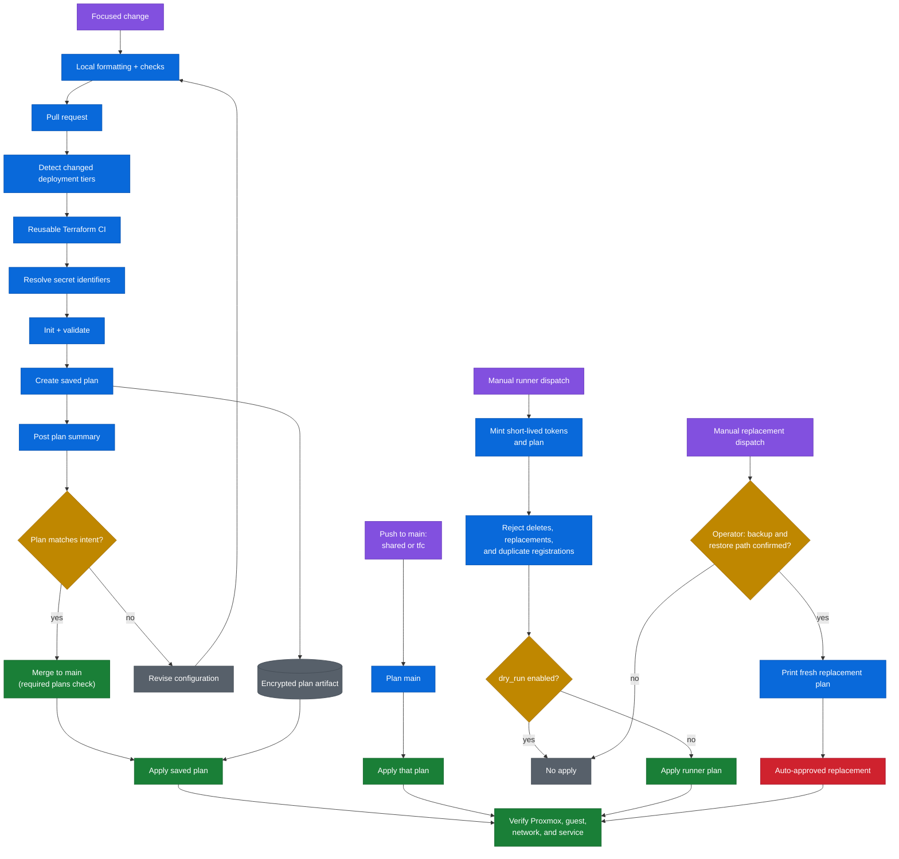

# Infrastructure delivery flow

Most deployments use the reviewed path on the left. Platform stacks, runner provisioning, and deliberate replacement are exceptional paths that plan and apply in the same run.

## Safety properties

1. Pull requests create plans but do not apply them.
2. A merge through `deploy.yaml` applies the encrypted pull-request plan rather than replanning `main`. The merge gate is the required `plans` check; no approval or environment reviewer is required.
3. `shared` and `tfc` replan on push to `main`, and a manual dispatch of `deploy.yaml` plans and applies in one run. These paths have no reviewed artifact.
4. Runner deployment defaults to plan-only and refuses deletes and replacements.
5. Replacement is explicitly destructive and auto-approved. Confirming a restore path is the operator's job; the workflow does not check it.
6. Every path ends with service-level verification, not merely a successful Terraform exit code.
