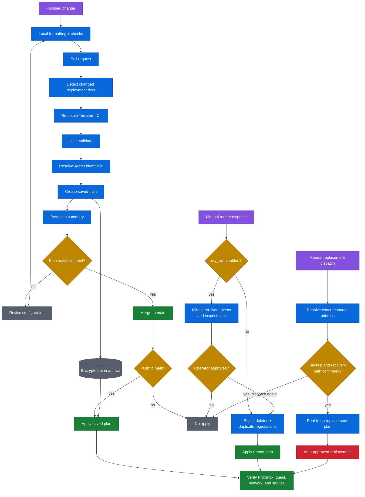

# Infrastructure delivery flow

Most deployments use the reviewed path on the left. Runner provisioning and deliberate replacement are exceptional paths with additional safeguards.

## Safety properties

1. Pull requests create plans but do not apply them.
2. Normal applies consume the encrypted, reviewed pull-request plan after merge rather than replanning `main`.
3. Runner deployment defaults to plan-only and refuses delete actions.
4. Replacement is explicitly destructive and requires a known restore path.
5. Every path ends with service-level verification, not merely a successful Terraform exit code.
