# Deployment and service map

Each colored boundary below, apart from the Proxmox prerequisites, represents a Terraform root module with separate state selection. Arrows between boundaries are runtime or provisioning dependencies, not shared Terraform state.

```mermaid
flowchart TB
    subgraph Prerequisites["Proxmox prerequisites"]
        VMTemplate["Ubuntu Noble<br/>VM template"]
    end

    subgraph Shared["shared"]
        NobleLXC["Ubuntu Noble<br/>LXC image"]
        VirtIO["VirtIO drivers"]
        WinISO["Windows 11 media<br/>(optional input)"]
    end

    subgraph Lab["lab"]
        OpenClaw["openclaw"]
        OpenClaw2["openclaw-2"]
        Pwnbox["pwnbox"]
        Win11["Windows 11"]
    end

    subgraph Cmd["cmd-and-ctrl"]
        CmdProd["production host"]
        CmdDev["development host"]
        R2Prod[("R2 backup bucket<br/>production")]
        R2Dev[("R2 backup bucket<br/>development")]
        IngressDev["Cloudflare Tunnel<br/>development"]

        CmdProd -.->|application-owned restic| R2Prod
        CmdDev -.->|application-owned restic| R2Dev
        IngressDev --> CmdDev
    end

    IngressProd["Cloudflare Tunnel<br/>production (managed by hand)"] --> CmdProd

    subgraph Frontends["frontends"]
        PFE["Private frontend host"]
        Gateway["Caddy gateway"]
        Homepage["Homepage portal"]
        Redlib["Redlib container"]
        PFE --> Gateway
        Gateway --> Homepage
        Gateway --> Redlib
    end

    subgraph LastDash["lastdash"]
        LastDashHost["Stateful application host"]
    end

    subgraph Media["plex"]
        PlexDev["Plex development"]
        PlexPrd["Plex production"]
    end

    subgraph FileServices["nfs"]
        NFSDev[("NFS development")]
        NFSPrd[("NFS production")]
    end

    subgraph Runners["gh-runner"]
        Controller["Runner controller"]
        Workers["Runner workers"]
    end

    subgraph TerraformCloud["tfc"]
        Projects["HCP Terraform projects"]
        Workspaces["Deployment workspaces"]
        Projects --> Workspaces
    end

    VMTemplate -->|clone source| OpenClaw
    VMTemplate -->|clone source| OpenClaw2
    VMTemplate -->|clone source| Pwnbox
    VMTemplate -->|clone source| CmdProd
    VMTemplate -->|clone source| CmdDev
    VMTemplate -->|clone source| PFE
    VMTemplate -->|clone source| LastDashHost
    VMTemplate -->|clone source| PlexDev
    VMTemplate -->|clone source| PlexPrd
    VMTemplate -->|clone source| Controller
    VMTemplate -->|clone source| Workers
    NobleLXC -->|container image| NFSDev
    NobleLXC -->|container image| NFSPrd
    VirtIO --> Win11
    WinISO --> Win11

    NFSDev -->|media export| PlexDev
    NFSPrd -->|media export| PlexPrd
    Gateway -->|private proxy| LastDashHost
    Controller -->|coordinates jobs| Workers

    classDef shared fill:#bf8700,stroke:#9a6700,color:#fff;
    classDef lab fill:#8250df,stroke:#6639ba,color:#fff;
    classDef apps fill:#1a7f37,stroke:#116329,color:#fff;
    classDef media fill:#0969da,stroke:#0550ae,color:#fff;
    classDef storage fill:#bc4c00,stroke:#953800,color:#fff;
    classDef runner fill:#57606a,stroke:#424a53,color:#fff;

    class VMTemplate shared;
    class NobleLXC,VirtIO,WinISO shared;
    class OpenClaw,OpenClaw2,Pwnbox,Win11 lab;
    class CmdProd,CmdDev,R2Prod,R2Dev,IngressProd,IngressDev lab;
    class PFE,Gateway,Homepage,Redlib,LastDashHost apps;
    class PlexDev,PlexPrd media;
    class NFSDev,NFSPrd storage;
    class Controller,Workers,Projects,Workspaces runner;
```

## Reading the map

- `shared` publishes the LXC image and installation media; it does not own the guests that consume them.
- Linux VMs clone a Proxmox template prepared outside the shared Terraform state.
- Development and production Plex hosts use their matching NFS environment.
- The `cmd-and-ctrl` deployment owns its guests, the development tunnel, and the R2 buckets, while the application owns backup scheduling and retention. The production tunnel is managed by hand.
- The frontend gateway provides private named access to LastDash and other selected services without owning those upstreams.
- The `tfc` stack manages HCP Terraform projects and workspaces, not the resources stored in their state.
- The runner stack is manually dispatched because it manages the machines that execute the rest of the delivery workflows.
- Windows installation remains partly interactive after Terraform creates its virtual hardware.
