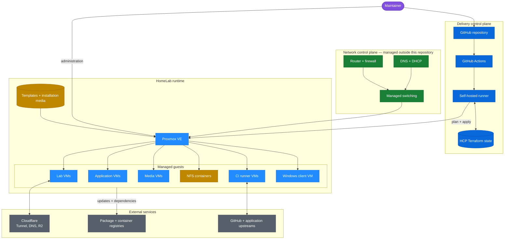

# Platform architecture

This view shows the systems involved in changing and running the lab. It separates the delivery control plane from the Proxmox runtime and from services that remain external to the repository.

## Ownership boundaries

| Boundary | Source of truth |
| --- | --- |
| Guest resources and attachment | Terraform in this repository |
| Resource identity and dependency state | HCP Terraform |
| First-boot guest configuration | Cloud-init templates |
| Pull-request checks and deployment | GitHub Actions |
| Routing, firewall, DNS, and DHCP | Network platform |
| Runtime status and consoles | Proxmox VE |
| Application data recovery | Workload-specific backup system |

The delivery systems are dependencies for making changes, but an outage in GitHub or HCP Terraform should not stop already-running guests. Proxmox and the network are runtime dependencies and therefore broader failure domains.
