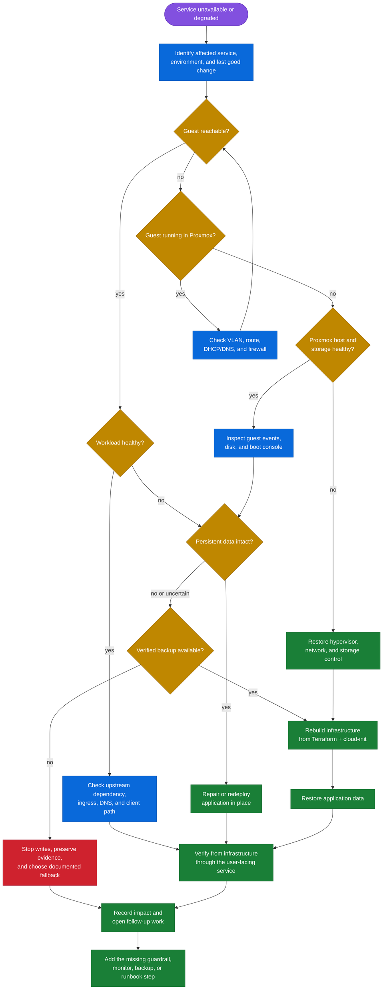

# Recovery decision flow

This chart is a first-response guide. It helps identify which source of truth to use before changing infrastructure during an outage.

## Recovery sources

| Problem | Start with |
| --- | --- |
| Resource missing or misconfigured | Terraform configuration, state history, and last reviewed plan |
| Guest cannot boot | Proxmox task history, console, disks, and template assumptions |
| Guest has no network | VLAN attachment, DHCP/static inputs, route, DNS, and firewall |
| Application broken but data intact | Application deployment path and service logs |
| Application data lost or corrupt | Verified off-node backup and workload restore procedure |
| Delivery system unavailable | Existing services continue running; restore runner and control-plane access before changing them |

The detailed commands and escalation notes remain in the [operations runbook](../../docs/runbook.md).
