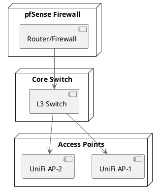

# Network Diagrams

This directory contains network topology diagrams for the homelab infrastructure.

## Diagrams Available

### Network Topology
- **network-topology.drawio**: Complete network topology (editable with draw.io)
- **network-topology.png**: Visual representation of the network architecture

### VLAN Layout
- **vlan-diagram.drawio**: VLAN segmentation and routing
- **vlan-diagram.png**: Visual VLAN layout

## Tools Used

- [draw.io](https://app.diagrams.net/): For creating and editing diagrams
- [Lucidchart](https://www.lucidchart.com/): Alternative diagramming tool
- [PlantUML](https://plantuml.com/): For text-based diagrams

## Creating Diagrams

### Using draw.io

1. Visit https://app.diagrams.net/
2. Create a new diagram
3. Use network shapes from the shape library
4. Export as PNG for documentation
5. Save .drawio file for future edits

### Using PlantUML



## Network Architecture Overview

```
Internet
  |
  |--- [ISP Modem]
         |
         |--- [pfSense Router/Firewall]
                |
                |--- [Core L3 Switch]
                       |
                       |--- VLAN 1 (Management)
                       |--- VLAN 10 (Servers)
                       |--- VLAN 20 (IoT)
                       |--- VLAN 30 (Guest)
                       |--- VLAN 40 (Lab)
                       |
                       |--- [Access Points]
                       |--- [Server Rack]
                            |--- [Proxmox Hosts]
                            |--- [NAS Storage]
                            |--- [Network Devices]
```

## Update Process

When making network changes:

1. Update the diagram to reflect changes
2. Export new PNG versions
3. Update documentation referencing the diagrams
4. Commit both .drawio source and PNG exports

## Best Practices

- Use consistent colors for device types
- Label all connections
- Include IP addresses where relevant
- Show VLAN assignments
- Document firewall rules visually
- Keep diagrams up to date with infrastructure changes

## Related Documentation

- **[Infrastructure Diagrams](../infrastructure/README.md)** - Infrastructure architecture
- **[Network Setup Guide](../../docs/network-setup.md)** - Detailed network configuration
- **[Terraform Network Modules](../../terraform/modules/network/README.md)** - Network IaC
- **[Main Documentation](../../docs/README.md)** - Complete homelab docs
