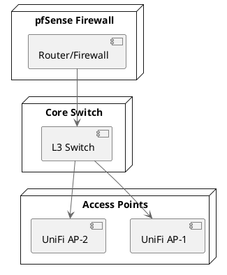

# Network Diagrams

This directory contains network topology diagrams for the homelab infrastructure.

## Diagrams Available

### Network Topology
- **network-topology.drawio**: Complete network topology (editable with draw.io)
- **network-topology.png**: Visual representation of the network architecture

### VLAN Layout
- **vlan-diagram.drawio**: VLAN segmentation and routing
- **vlan-diagram.png**: Visual VLAN layout

## Tools Used

- [draw.io](https://app.diagrams.net/): For creating and editing diagrams
- [Lucidchart](https://www.lucidchart.com/): Alternative diagramming tool
- [PlantUML](https://plantuml.com/): For text-based diagrams

## Creating Diagrams

### Using Mermaid.js

1. Pull and run latest [mmd-cli](https://github.com/mermaid-js/mermaid-cli) with

```bash
docker run --rm -u `id -u`:`id -g` \
-v $(pwd):/data minlag/mermaid-cli \
-i <file-name>.mmd --icon-packs "@iconify-json/material-symbols""
```

### Using draw.io

1. Visit https://app.diagrams.net/
2. Create a new diagram
3. Use network shapes from the shape library
4. Export as PNG for documentation
5. Save .drawio file for future edits

### Using PlantUML - THIS IS BEING DEPRECATED - TO BE REMOVED


```plantuml
@startuml Network Topology
!include <C4/C4_Container>

node "pfSense Firewall" {
  [Router/Firewall]
}

node "Core Switch" {
  [L3 Switch]
}

node "Access Points" {
  [UniFi AP-1]
  [UniFi AP-2]
}

[Router/Firewall] --> [L3 Switch]
[L3 Switch] --> [UniFi AP-1]
[L3 Switch] --> [UniFi AP-2]

@enduml
```

## Network Architecture Overview

```
Internet
  |
  |--- [ISP ONT]
         |
         |--- [OPNsense Router/Firewall]
                |
                |--- [Core L3 Switch]
                       |
                       |--- VLAN 1   (Mgmt)
                       |--- VLAN 10  (DNS)
                       |--- VLAN 20  (Lab)
                       |--- VLAN 100 (Home)
                       |--- VLAN 101 (IOT)
                       |
                       |--- [Access Points]
                       |--- [Server Rack]
                            |--- [Proxmox Hosts]
                            |--- [NAS Storage]
                            |--- [Network Devices]
```

## Update Process

When making network changes:

1. Update the diagram to reflect changes
2. Export new PNG versions
3. Update documentation referencing the diagrams
4. Commit both .drawio source and PNG exports

## Best Practices

- Use consistent colors for device types
- Label all connections
- Include IP addresses where relevant
- Show VLAN assignments
- Document firewall rules visually
- Keep diagrams up to date with infrastructure changes
