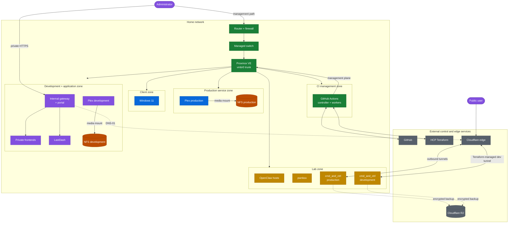

# Network topology and traffic paths

This diagram combines workload placement with the two important cross-boundary paths: infrastructure delivery and public ingress. It intentionally omits physical switch ports, full addressing, and firewall rule details.

## What the arrows mean

- Solid arrows inside the Proxmox boundary show attachment or a required service path.
- Tunnel arrows show public traffic terminating at Cloudflare and reaching the guests through outbound connectors.
- The internal gateway path is available only to trusted clients and VPN users; its Cloudflare traffic is outbound certificate automation, not public ingress.
- Dashed R2 arrows show application-owned backup traffic.
- Runner arrows show why the CI network is trusted: it reaches GitHub, state, and Proxmox management interfaces.

VLAN identifiers, internal addressing, switch ports, firewall policy, DHCP pools, and internal DNS are intentionally omitted from this public view. They remain authoritative in Terraform and on the network platform.
