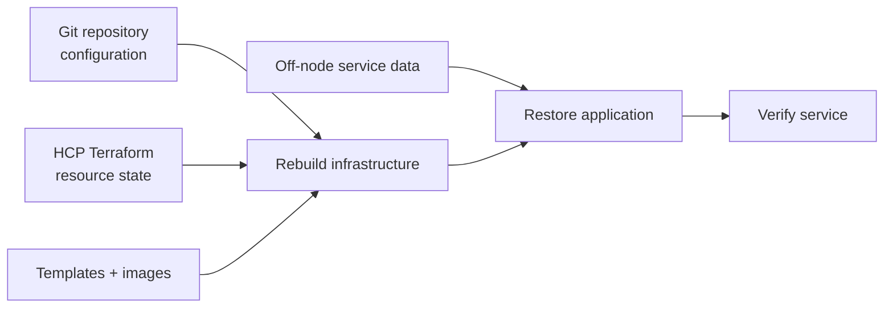

# Backup and recovery strategy

The recovery model separates infrastructure reconstruction from data restoration. Terraform, templates, and cloud-init can recreate machines; they cannot recreate application data that existed only on a guest disk.

## Protection layers

| Layer | Protects | Does not protect |
| --- | --- | --- |
| Git | Terraform, cloud-init, workflows, and runbooks | Runtime data and secrets |
| HCP Terraform | Resource identity and dependency state | Guest files and databases |
| Proxmox snapshot or backup | A point-in-time guest or disk | The Proxmox failure domain unless copied elsewhere |
| NFS | Shared media access | A second copy of that media by itself |
| Object storage / restic | Selected application data off-node | Services that have not been enrolled |

## Current implementation

The `cmd-and-ctrl` deployment provisions separate Cloudflare R2 buckets for its production and development environments. Retention and uploads are owned by that application's restic job, not by this repository. Terraform creates the buckets and an incomplete-multipart-upload cleanup rule; it deliberately does not expire completed restic objects because age-based object deletion can corrupt a repository.

Other workload backup jobs are not codified in this repository today. Proxmox backup configuration may exist operationally, but it is outside this codebase and must be verified on the live platform before relying on it.

The `scripts/backup/` directory is a reserved workspace, not evidence of an automated backup system.

## Recovery objectives

Until measurements and restore exercises provide better numbers, use service tiers instead of invented RPO/RTO promises:

| Tier | Examples | Recovery expectation |
| --- | --- | --- |
| Critical control plane | Proxmox access, network services, CI runner access | Restore enough control to operate the lab first |
| Stateful production | `cmd_and_ctrl`, LastDash, media metadata, shared storage | Restore from the latest verified off-node copy |
| Rebuildable service | Frontend hosts, runner workers, disposable lab VMs | Recreate from Terraform and cloud-init |
| Archival or replaceable | Installation media, downloaded templates | Download or regenerate from the upstream source |

Record measured restore time and the oldest acceptable data point during each recovery exercise. Those measurements should become explicit objectives later.

## Pre-change backup check

Before any plan that replaces or deletes a stateful resource:

1. Identify the data that is not represented in Git.
2. Locate the most recent backup in a different failure domain.
3. Confirm its timestamp, size, and job status.
4. Verify the credentials and instructions required to restore it.
5. Prefer a small restore test over trusting a green backup job.
6. Record who approved the destructive change and when it will occur.

A backup that has never been restored is an assumption.

## Recovery patterns

### Rebuild a stateless VM

1. Confirm the target resource address and plan.
2. Recreate it through the normal or manual replacement workflow.
3. Wait for cloud-init to finish.
4. Re-register or reauthenticate integrations that are intentionally manual.
5. Verify service health and remove any stale registrations.

### Restore a stateful application

1. Stop writers to avoid diverging data.
2. Rebuild or repair the infrastructure layer.
3. Mount or attach the intended persistent storage.
4. Restore the application data with the application's own tool.
5. Validate consistency before reopening traffic.
6. Record the recovered point in time and any lost interval.

### Recover Terraform control

If a workspace or state operation fails, do not create a replacement workspace immediately. Confirm the organization, workspace selection, and backend configuration first. Use HCP Terraform state history for recovery and take a copy before any manual state operation.

### Recover from Proxmox host loss

1. Restore the hypervisor and management network.
2. Recover or reconnect storage.
3. Restore the minimum services needed for Terraform execution.
4. Recreate shared templates and images.
5. Restore stateful services from backups.
6. Rebuild stateless services from code.
7. Validate VLAN placement and application dependencies.

## Restore exercise

Run a focused recovery exercise at least quarterly or after a major storage change:

- choose one service and one backup point
- restore to an isolated name and network location
- verify application-level data, not just file presence
- measure recovery time
- delete the test restoration when complete
- update this document and the service runbook with anything that was missing

## Roadmap

- [ ] Inventory every stateful path and its owner.
- [ ] Codify Proxmox backup policy and off-node replication.
- [ ] Add backup success and age monitoring.
- [ ] Add encrypted, automated backups for remaining stateful services.
- [ ] Document measured recovery objectives.
- [ ] Schedule and record recurring restore tests.
