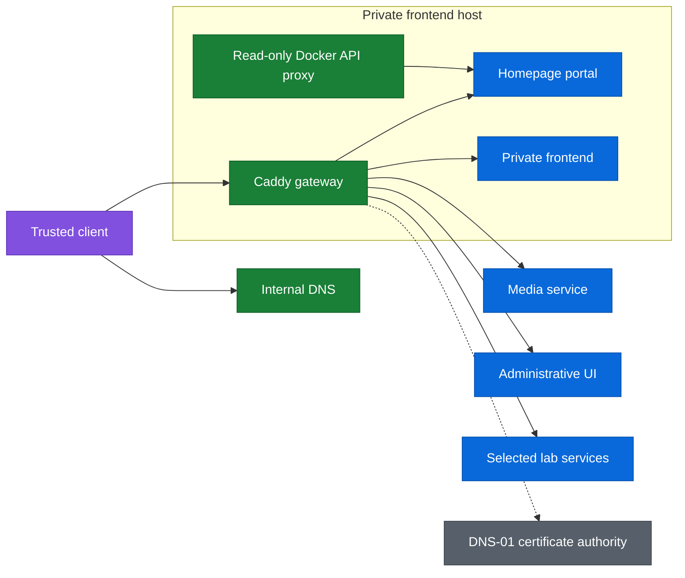
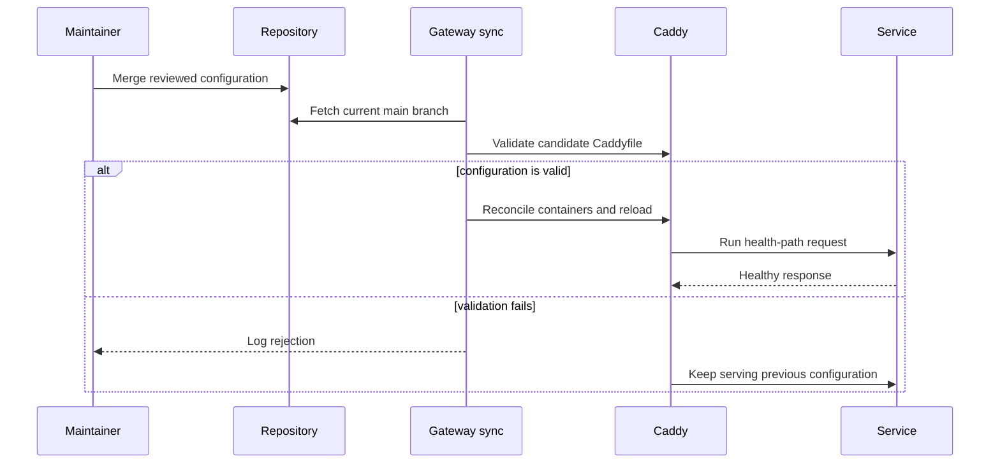

# Gateway and internal portal

The gateway gives trusted clients one HTTPS entry point for private services without publishing those services to the internet. It combines Caddy for reverse proxying and certificate management with Homepage for service discovery.

The repository contains the custom Caddy image, runtime configuration, and host bootstrap. Treat the live rollout as an operational fact to verify rather than assuming it from the presence of code.

## Design goals

- Keep the portal and its upstream services private to trusted networks and VPN clients.
- Use ordinary HTTPS certificates without opening inbound internet access.
- Give each service a memorable internal name while retaining direct access for recovery.
- Keep frequently changed proxy and portal configuration out of cloud-init.
- Expose only the minimum Docker API surface needed by the dashboard.
- Make a bad configuration update fail validation without replacing the last working configuration.

## Architecture

Internal DNS resolves approved service names to the gateway. Caddy terminates TLS and forwards each request either to a container on its private Docker network or to an explicitly allowed upstream. The gateway is a convenience layer: direct service access remains available for recovery when the proxy is unavailable.

## Key decisions

| Decision | Choice | Consequence |
| --- | --- | --- |
| Reach | Trusted networks and VPN only | The gateway creates no new public ingress path. |
| Portal | Homepage | Service cards and layout remain reviewable as YAML. |
| Proxy | Caddy with the Cloudflare DNS module | Certificates use DNS-01 without inbound validation traffic. |
| Placement | Existing private frontend host | No extra VM is required, but the portal and frontend share a failure domain. |
| Naming | Explicit host records | A broad wildcard cannot accidentally shadow unrelated public or management names. |
| Delivery | Pull and validate | The host does not need an inbound CI or SSH path. |

## Why runtime configuration stays out of cloud-init

Cloud-init is first-boot configuration. In the current Proxmox module, changing the uploaded cloud-init snippet can propagate into VM replacement. That behavior is appropriate for rebuilding a host, but not for ordinary edits such as adding a proxy route or changing a dashboard card.

The ownership boundary is therefore deliberate:

| Layer | Owns |
| --- | --- |
| Terraform | VM lifecycle, network attachment, and first-boot inputs |
| Cloud-init | Docker installation, directories, secret handoff, and sync service bootstrap |
| `gateway/` | Compose, Caddy, Homepage, frontend, and sync configuration |
| Host runtime | Certificate data and environment files containing credentials |

The `gateway-sync` timer fetches the public repository, validates the candidate Caddyfile, copies the approved configuration into the live directory, and reconciles the Compose project. A validation failure leaves the last working configuration in place.

This split also protects the certificate store. Rebuilding the VM for routine configuration would create needless downtime and could trigger certificate-authority rate limits.

## TLS and DNS

Caddy obtains per-service certificates with the DNS-01 challenge. The challenge proves control through the DNS provider API, so no inbound internet connection to the gateway is required.

Per-service certificates are preferred to one broad wildcard. A compromised gateway then exposes only the names it serves instead of a key capable of impersonating every host in the zone.

Internal DNS should use explicit records on every resolver clients may query. Avoid a zone-wide wildcard or suffix override: it can capture public applications and infrastructure control-plane names that must continue resolving elsewhere.

Keep human-facing proxy names separate from endpoints used by automation. In particular, Terraform should continue talking directly to the Proxmox management endpoint instead of depending on the convenience proxy it manages.

## Security boundaries

- Caddy is the only container that publishes host ports.
- Application containers communicate over a private Docker network.
- Homepage reaches Docker through a read-only socket proxy with only the required API enabled.
- Credentials live in host environment files and secret stores, never in tracked YAML or Markdown.
- DNS credentials should be scoped to the required zone and permissions.
- Inter-zone firewall access should be granted per destination and service, not from the gateway to an entire network.
- Container images are pinned where upgrade behavior matters and run with reduced privileges where supported.

The gateway can reach several trust zones by design, which makes it a high-value host. Treat changes to its routes, credentials, and container images with the same care as changes to the CI runners.

## Adding a service

1. Add one Caddy route that targets the service's stable internal endpoint.
2. Add an explicit internal DNS record on each resolver.
3. Permit only the required gateway-to-upstream traffic in the firewall.
4. Add a Homepage card if the service belongs in the portal.
5. Validate the configuration and confirm direct access still works before relying on the proxy path.

Do not place credentials directly in `gateway/homepage/`. Homepage variables should reference values supplied through the host environment.

## Delivery sequence

## Rollout order

1. Build and verify the custom Caddy image includes the DNS provider module.
2. Install the sync service and prove invalid configuration is rejected safely.
3. Assign the host a stable address and verify DNS resolution from trusted clients.
4. Proxy one low-risk frontend and confirm certificate issuance.
5. Add Homepage without enabling credentialed widgets.
6. Add remaining upstreams one at a time, including DNS and firewall review.
7. Enable widgets only after their read-only credentials and failure behavior are understood.

The first two stages are represented in this repository. Confirm deployment state and remaining prerequisites on the live platform before advancing the rollout.

## Operational checks

When the portal is unreachable, work from the bottom up:

1. Resolve the requested name from a trusted client.
2. Confirm the gateway host and Caddy container are healthy.
3. Inspect the sync service for a rejected update.
4. Test the upstream directly from the gateway.
5. Verify the narrow firewall path and the upstream service itself.

A blank Homepage response commonly means its allowed-host setting does not match the browser-facing name. Certificate failures usually belong to DNS permissions, resolver visibility, or provider authentication. Missing routes should first be checked against sync validation logs.

Never print environment files or tokens while troubleshooting. Record only the failing permission, component, and response code.

## Recovery

The portal and proxy are not the source of truth for the services behind them. If the gateway fails:

- use direct management paths from a trusted network
- preserve the certificate volumes before destructive Compose operations
- rebuild the host from Terraform and cloud-init only when in-place repair is unsuitable
- restore runtime credentials through the secret-management path
- let `gateway-sync` repopulate public configuration from the repository

Internal addresses, DNS names, firewall rules, and credential identifiers are intentionally omitted from this public design document. The executable configuration and private network platform remain authoritative for those details.
