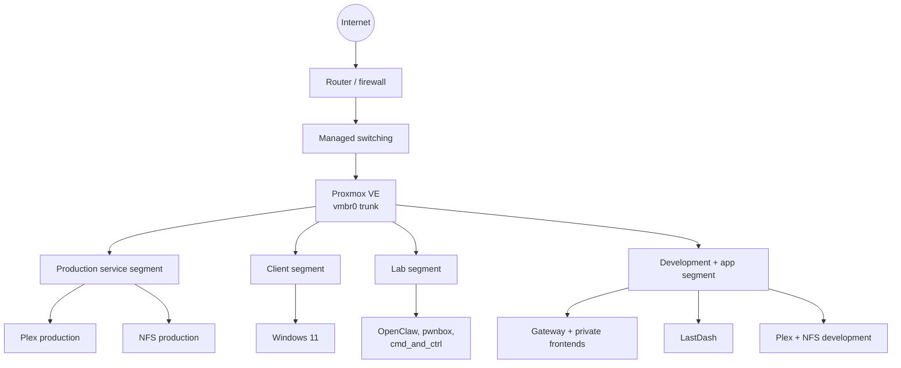

# Network design

Terraform attaches guests to the correct Proxmox bridge and VLAN. Routing, DHCP, DNS, firewall policy, and switch configuration are managed outside this repository.

## Logical layout



## Segments represented in code

| Zone | Role in this repository | Example workloads |
| --- | --- | --- |
| Production services | Media and shared storage | Plex production, NFS production |
| Client systems | Desktop and interactive clients | Windows 11 VM |
| Lab | Application experiments and public application hosts | OpenClaw, pwnbox, `cmd_and_ctrl` |
| Development and apps | Private applications, internal gateway, and non-production services | Gateway, Redlib, LastDash, Plex development, NFS development |
| CI | Delivery workers on a management-capable path | GitHub Actions runners |

This public view deliberately omits VLAN identifiers, internal addressing, switch ports, and firewall rules. The authoritative values live in Terraform and on the network platform.

## Addressing model

Most Linux VMs use DHCP during cloud-init. The NFS containers use static IPv4 addresses because other services mount them directly. The reusable `pm-cloudinit-vm` module supports optional static addressing, DNS servers, a search domain, and a pinned MAC address.

When assigning a static address:

1. Check the live DHCP scope on the router.
2. Choose an address outside that scope or reserve the address deliberately.
3. Include the actual prefix length, for example `192.0.2.20/24`.
4. Use a bare gateway address, for example `192.0.2.1`.
5. Supply working DNS resolvers if the guest no longer receives them through DHCP.
6. Confirm the address is unused before applying.

The addresses above use the documentation-only `192.0.2.0/24` range; they are not lab addresses.

Do not infer a free address from gaps in Terraform or from a host that happens not to answer. An incorrect static address can create an intermittent conflict on a live segment.

## Traffic expectations

The minimum useful policy is:

- self-hosted runners can reach the required delivery control planes and management endpoints
- application guests can reach package repositories and their explicit upstream dependencies
- Plex development mounts only the development NFS export
- Plex production mounts only the production NFS export
- management interfaces are not broadly reachable from workload VLANs
- unsolicited inter-VLAN traffic is denied unless a documented service path needs it

The repository does not currently enforce these rules. Verify them on the firewall whenever adding a deployment dependency.

## DNS and public ingress

Internal name resolution is supplied by the network's DNS infrastructure. The private [gateway](gateway.md) gives trusted clients named HTTPS access without creating public ingress. Public `cmd_and_ctrl` environments use Cloudflare Tunnels managed by their dedicated Terraform deployment.

Cloudflare terminates public TLS for these services. Hostnames are kept one label below the zone so they remain covered by the standard wildcard certificate.

## Troubleshooting

### Guest has no lease

Check the Proxmox network device, VLAN tag, bridge, DHCP scope, and switch trunk. From the guest console:

```bash
ip -brief link
ip -brief address
journalctl -u systemd-networkd --no-pager
```

### Guest has an address but no outbound access

```bash
ip route
ping -c 3 <vlan-gateway>
resolvectl query github.com
```

If the gateway responds but names do not resolve, inspect DNS. If the gateway does not respond, inspect VLAN placement and firewall policy first.

### NFS mount fails

Confirm the consumer points to the NFS server in the same environment and that TCP/UDP 2049 is allowed across the relevant path. Avoid solving a development problem by opening production storage broadly.

## Change checklist

- [ ] Confirm the intended VLAN and environment.
- [ ] Verify address availability and DHCP boundaries.
- [ ] Review inter-VLAN and outbound firewall requirements.
- [ ] Update Terraform and this document if the segment's role changes.
- [ ] Plan the affected deployment.
- [ ] Verify connectivity from the guest after apply.
