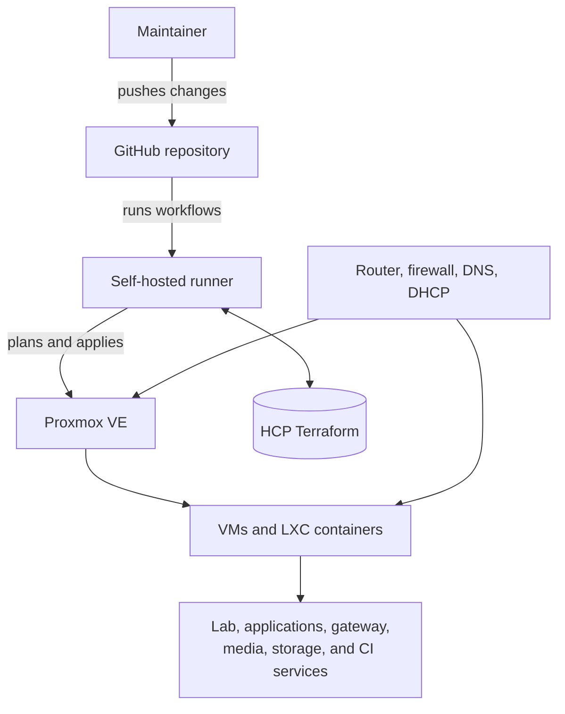
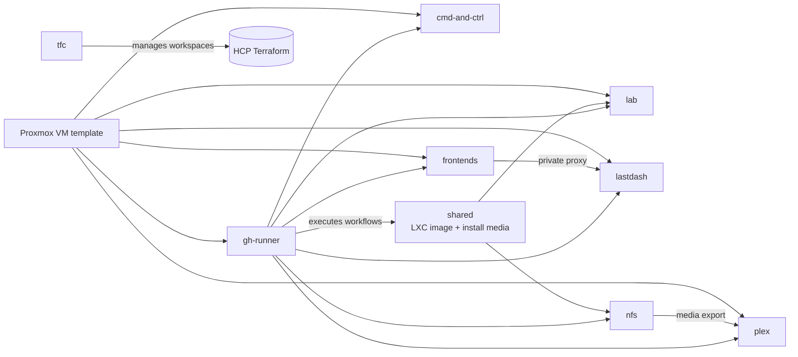

# Architecture overview

The lab is a small production environment built around one goal: make infrastructure changes repeatable without hiding the operational consequences. Proxmox supplies the runtime, Terraform owns the resource definitions, cloud-init bootstraps Linux guests, and GitHub Actions provides the review and delivery path. Bitwarden Secrets Manager supplies selected deployment secrets without putting their values in Git.

## System context

The repository controls the compute side of this boundary. Router rules, DHCP pools, DNS infrastructure, and physical switch configuration remain external dependencies and are documented only at the level needed to operate the workloads safely.

The [diagram gallery](../diagrams/README.md) expands this overview into dedicated platform, deployment, delivery, network, and recovery views. Public diagrams intentionally omit internal addressing and low-level management details.

## Layers

### Delivery

GitHub Actions runs formatting, validation, linting, security scans, module tests, and deployment workflows. The central deployment workflow detects changed application tiers, resolves their secret identifiers through Bitwarden, creates encrypted Terraform plans for review, and applies those plans only after a merge to `main`. GitHub runner provisioning is manual and starts in dry-run mode because those machines are part of the delivery system itself.

### Infrastructure as code

Each directory under `terraform/deployments/` is an independently initialized root module with its own HCP Terraform workspace or workspace tag. This limits the blast radius of routine changes.

The current deployment boundaries are:

- `lab`: experimental and application-specific VMs
- `cmd-and-ctrl`: development and production application hosts, ingress, and backup buckets
- `frontends`: internal gateway and private frontend services
- `lastdash`: stateful application host
- `plex`: media-server VMs
- `nfs`: storage-serving LXC containers
- `shared`: images and templates consumed by other stacks
- `gh-runner`: self-hosted CI controller and workers
- `tfc`: HCP Terraform projects and workspaces

### Provisioning

Linux VMs clone an Ubuntu 24.04 template and receive rendered cloud-init snippets. Cloud-init installs packages, writes service configuration, and enables workloads on first boot. It is not a general-purpose configuration-management system: changing a snippet does not reliably mutate an existing guest.

The `ansible/` directory is reserved for later convergence work. No Ansible playbooks are currently part of the production path.

### Runtime

Proxmox VE runs virtual machines and LXC containers. Workload placement is segmented by VLAN, while shared media storage is exported by NFS. Docker is installed inside selected guests for application packaging; it is not the infrastructure control plane.

## Deployment relationships

These arrows describe operational dependencies, not Terraform cross-state references. Deployment state remains separate.

## Important design decisions

### Small state boundaries

Separating deployments keeps an unrelated provider or configuration change from producing a plan across the whole lab. It also makes ownership and recovery clearer: a Plex change belongs to the Plex workspace.

### Pinned module sources

Deployments consume the reusable Proxmox module by Git ref. A module change and a consumer upgrade are therefore separate, reviewable events. This costs some release overhead but avoids silently changing every VM when the module's default behavior evolves.

### Explicit lifecycle behavior

Cloud-init file changes can cause a provider to see a replacement path through `user_data_file_id`. Long-lived guests and CI runners use explicit lifecycle decisions where an automatic rebuild would be more dangerous than configuration drift. When that protection is in place, the tradeoff is documented: template edits require a deliberate replacement to reach the guest.

### CI-first applies

Pull requests create the review surface. Merges create the deployment event. The manual replacement workflow exists for a narrow break-glass case and prints a fresh plan before applying.

## Current and historical components

| Component | Status | Notes |
| --- | --- | --- |
| Proxmox Terraform deployments | Active | Production path for compute and shared artifacts |
| Cloud-init templates | Active | First-boot provisioning for Linux VMs |
| HCP Terraform state | Active | Workspace-per-deployment or tagged workspace selection |
| GitHub Actions delivery | Active | Plans, applies, module tests, and repository checks |
| Bitwarden Secrets Manager | Active | Resolves selected deployment secrets by identifier during CI |
| Docker workloads | Active | Used inside selected guests and for the Windows media helper |
| Internal gateway | Active configuration | Caddy and Homepage configuration is synchronized from `gateway/` |
| Kubernetes bootstrap scripts | Reference | Retained under `scripts/`; not part of a current Terraform deployment |
| Ansible | Planned | Directory exists, but no playbooks or roles are active |
| Monitoring automation | Planned | Operational checks are not yet codified here |
| Backup automation | Planned | Recovery expectations are documented; scripts are not implemented |

## Failure domains

- **Proxmox host:** affects all guests on the node.
- **HCP Terraform or GitHub:** blocks automated changes but should not interrupt already-running services.
- **Self-hosted runner:** blocks plans and applies that require access to the private environment.
- **NFS service:** affects media availability while leaving the Plex guest itself running.
- **Internal gateway:** affects convenient names and the portal, while direct recovery paths remain available.
- **Router, DNS, or DHCP:** can make healthy guests unreachable without creating a Terraform diff.
- **Individual deployment state:** limits most configuration mistakes to one stack.

Recovery procedures and verification commands are in the [runbook](runbook.md); data-protection assumptions are in the [backup strategy](backup-strategy.md).
