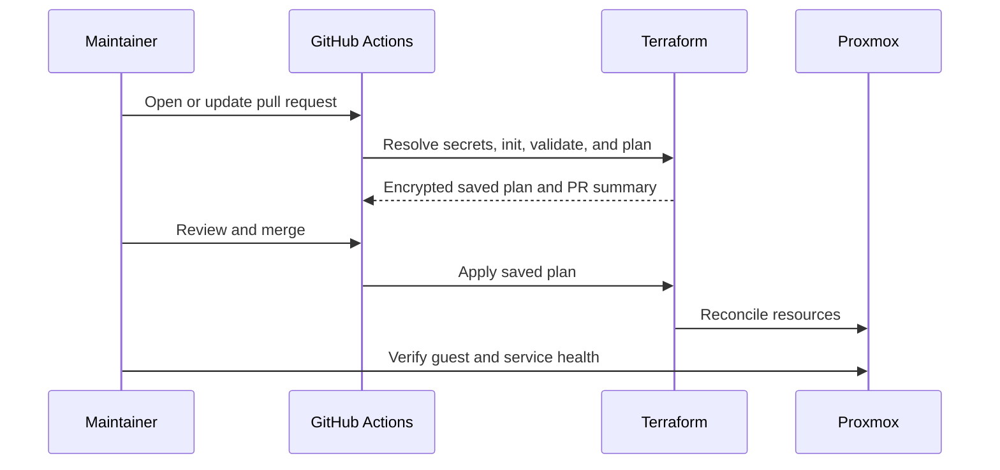

# Operations runbook

This runbook covers the routine path from a Terraform change to a healthy service, plus the checks to make before any intentional replacement.

> **Default rule:** plan locally if useful, but apply through GitHub Actions. A clean plan is necessary; a reviewed plan is what makes it safe.

## Before you begin

You need:

- Terraform `1.14.3`
- access to the configured HCP Terraform organization
- the appropriate GitHub environment and Bitwarden Secrets Manager access
- access to a self-hosted runner for workflows that reach Proxmox
- SSH agent access to the Proxmox key when a provider operation requires it

Install the repository checks once:

```bash
pre-commit install
```

Run them before pushing:

```bash
pre-commit run --all-files
```

## Deployment inventory

| Stack | Terraform root | Variable files | State selection |
| --- | --- | --- | --- |
| Lab | `terraform/deployments/lab` | `env/lab/terraform.tfvars` | `lab` |
| Cmd and Ctrl | `terraform/deployments/cmd-and-ctrl` | `env/{dev,prd}/terraform.tfvars` | `cmd-and-ctrl-{dev,prd}` |
| Frontends | `terraform/deployments/frontends` | `env/prd/terraform.tfvars` | `frontends-prd` |
| LastDash | `terraform/deployments/lastdash` | `env/prd/terraform.tfvars` | `lastdash-prd` |
| Plex | `terraform/deployments/plex` | `env/{dev,prd}/terraform.tfvars` | `plex-{dev,prd}` |
| NFS | `terraform/deployments/nfs` | `env/{dev,prd}/terraform.tfvars` | `nfs-{dev,prd}` |
| Shared artifacts | `terraform/deployments/shared` | `env/shared/terraform.tfvars` | `shared` |
| GitHub runners | `terraform/deployments/gh-runner` | `env/gh-{controller,worker}.tfvars` | `GH-Controller` or `GH-Worker` |
| Terraform Cloud | `terraform/deployments/tfc` | `env/tfc/terraform.tfvars` | `tfc` |

## Plan a change locally

Choose one deployment and initialize it in place:

```bash
cd terraform/deployments/<deployment>
terraform init
terraform fmt -check -recursive
terraform validate
terraform plan -var-file=env/<environment>/terraform.tfvars
```

The `gh-runner` stack uses flat variable files instead:

```bash
cd terraform/deployments/gh-runner
TF_WORKSPACE=GH-Worker terraform plan \
  -var-file=env/gh-worker.tfvars \
  -var='gh_registration_token=<short-lived-token>'
```

Supply secrets through environment variables or the configured Bitwarden/GitHub secret path. Do not place values in `.tfvars`, `secrets.env`, shell history, a plan pasted into an issue, or documentation. Files named `secrets.env` contain secret identifiers, not secret values.

## Read the plan

Do not stop at the summary line. For every changed resource, answer:

1. Is this the deployment and environment I intended to change?
2. Is every create, update, delete, or replacement expected?
3. Does an `initialization` or cloud-init diff imply a guest restart or rebuild?
4. Is persistent data on a disk, mount, or external backup that survives the action?
5. Can the service be verified and rolled back after the apply?

An unexpected replacement of `openclaw-2`, either `cmd_and_ctrl` environment, the gateway, or LastDash is a stop condition. These guests contain manual identity or persistent state that deserves an explicit recovery decision before replacement.

Useful inspection commands:

```bash
terraform show
terraform state list
terraform state show '<resource-address>'
```

`terraform state` commands are diagnostic here. Do not move, remove, or import state as a speculative fix.

## Normal deployment flow

Most deployment workflows follow the same lifecycle:



Pull requests must not apply infrastructure. The central deployment workflow plans changed tiered stacks, encrypts the saved plans, and applies those exact pull-request artifacts only after the commit reaches `main`. Dedicated platform workflows must preserve the same review and event gates.

## Verify an apply

Start at the infrastructure layer and move upward:

1. Confirm the workflow completed successfully.
2. Confirm the expected resource exists and is running in Proxmox.
3. For a new Linux guest, inspect cloud-init:

   ```bash
   cloud-init status --long
   sudo journalctl -u cloud-final --no-pager
   ```

4. Confirm the guest has the expected address and route:

   ```bash
   ip -brief address
   ip route
   resolvectl status
   ```

5. Confirm the workload itself:

   ```bash
   systemctl --failed
   docker compose ps
   ```

Use the command that matches the guest; not every VM runs Docker.

## Intentional replacement

Replacement is a recovery or rollout operation, not routine configuration management. Before replacing a guest:

- identify exactly which state address will be replaced
- confirm the latest usable backup and restore path
- record any manual state that cloud-init cannot recreate
- verify the service's acceptable downtime
- confirm the plan contains no collateral delete actions

For deployments that use the standard `env/<environment>/terraform.tfvars` layout, dispatch the **Terraform Replace** workflow with the full resource address, deployment name, and environment. The workflow prints a fresh plan and then performs an auto-approved replacement, so the inputs are the approval boundary.

Example using the GitHub CLI:

```bash
gh workflow run terraform-replace.yaml \
  -f replace_resource='module.example.proxmox_virtual_environment_vm.this' \
  -f deployment_name=lab \
  -f environment=lab \
  -f terraform_version=1.14.3
```

The generic replacement workflow does not match the `gh-runner` stack's current flat variable-file layout. Rebuild runners through `gh-runner-deploy.yaml`, one controlled change at a time, and keep `dry_run` enabled until the plan has been inspected.

## Common failure modes

### Terraform cannot select a workspace

Check the deployment's backend block and set the expected workspace when it uses tags:

```bash
export TF_WORKSPACE=<workspace>
terraform init -reconfigure
```

### Proxmox authentication fails

Confirm the correct API credential is present in the GitHub environment or local shell. If the provider operation uploads snippets or touches disks over SSH, also confirm the SSH agent contains the Proxmox key:

```bash
ssh-add -l
```

Do not print token values while diagnosing authentication.

### A new VM has no address

Check, in order:

1. VLAN ID and bridge in the environment's `.tfvars`
2. DHCP availability on that VLAN, or the full static address/gateway/DNS set
3. Proxmox guest console output
4. `cloud-init status --long` and the cloud-init logs

A static address must include its prefix length. A gateway must be a bare IPv4 address.

### Cloud-init changes do not reach a guest

That can be expected. Cloud-init is first-boot data, and protected resources intentionally ignore parts of `initialization` to prevent accidental replacement. Deliver application changes through the application's deployment path or schedule a deliberate VM rebuild.

### NFS is available but Plex cannot see media

Check the dependency from both ends:

```bash
# On the NFS server
exportfs -v
systemctl status nfs-kernel-server

# On the Plex host
findmnt -t nfs,nfs4
mount | grep /mnt
```

Then verify VLAN policy and the environment-specific NFS address in the Plex `.tfvars` file.

### A plan shows an unexpected replacement

Stop. Save the plan output, identify the attribute marked `forces replacement`, and compare it with the current state. Common triggers in this repository include cloud-init file IDs, clone settings, initialization blocks, and changes to resource addressing. Do not solve an unexplained replacement with `-target`, `taint`, or state removal.

## Incident notes

For an outage, keep a short timeline with:

- the first observed symptom and affected service
- the last known good deployment
- relevant workflow run and commit
- containment action
- recovery action and verification
- follow-up issue for any missing guardrail

The useful outcome is not a perfect narrative; it is enough context to avoid repeating the same failure.
