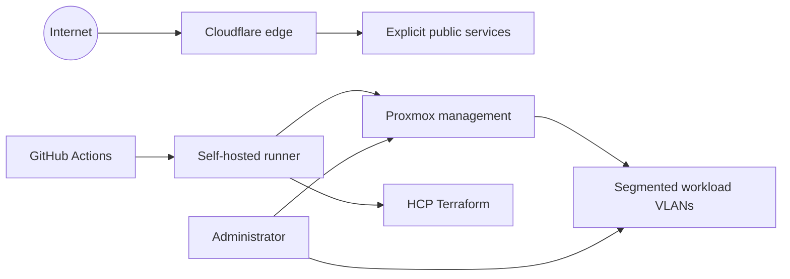

# Security model

This lab uses layered controls: network segmentation limits reachability, short-lived or scoped credentials limit authority, and the pull-request workflow makes infrastructure changes reviewable. It is still a homelab, so the security goal is practical risk reduction with honest documentation of the remaining gaps.

## Trust boundaries

The self-hosted runner is highly trusted: it can reach management services and receives deployment credentials. Workload VMs should not inherit that level of access.

## Credentials

Deployment secret values are resolved from Bitwarden Secrets Manager or supplied through narrowly scoped GitHub environments. HCP Terraform and workload-specific stores own the secrets appropriate to their systems. Tracked `.tfvars` files contain non-secret environment configuration only; tracked `secrets.env` files map variable names to Bitwarden item identifiers, never values.

Current credential classes include:

- Proxmox API and SSH access
- HCP Terraform API access
- GitHub runner registration and repository tokens
- Cloudflare API, tunnel, and service tokens
- application administrator tokens

Apply these rules to each credential:

- grant only the permissions and environments it needs
- prefer a short lifetime when the integration supports one
- use separate development and production credentials
- mask values in workflow logs
- rotate after suspected exposure or when an operator loses access
- never paste a secret into an issue, pull request, plan excerpt, or documentation page

Terraform plan files can contain sensitive values even when terminal output redacts them. CI encrypts saved plans before upload, retains them briefly, and removes plaintext copies in cleanup steps. Treat the encrypted artifacts and their key as separate sensitive assets.

## CI/CD controls

The standard infrastructure path separates review from execution:

1. Pull requests run checks and create a Terraform plan.
2. The workflow posts a create/change/destroy summary.
3. CI encrypts the saved plan before storing the short-lived artifact.
4. A merge to `main` identifies the successful plan run for the pull-request head.
5. The apply job decrypts and uses that exact saved plan instead of replanning.

The `main` ruleset is the merge gate. It requires a pull request, squash merges, a passing `plans` check on an up-to-date branch, and clean CodeQL and code-quality results. It does not require approvals, and the `prd` environment has no reviewer. A merge therefore applies prd directly, and reading the plan summary is the review.

Only merges through `deploy.yaml` apply a reviewed artifact. These paths plan and apply in one run:

- a manual dispatch of `deploy.yaml`
- `shared.yaml` and `tfc.yaml` on push to `main`
- `terraform-replace.yaml`

The reusable CD workflow still refuses to run outside `main`.

The GitHub runner deployment is manual, uses short-lived registration tokens, rejects destroy actions, checks for duplicate registered runner names, and defaults to plan-only execution.

## Network controls

- keep Proxmox management access off general workload networks
- deny inter-VLAN traffic by default and allow named service paths
- expose public services through a managed ingress path rather than direct guest port forwarding
- keep development services and storage separate from production
- restrict NFS to its intended consumers
- treat DNS and DHCP changes as security-relevant infrastructure changes

Network policy is configured outside this repository. The VLAN assignments in Terraform are only one half of the control.

## Host and workload controls

- start from maintained Ubuntu 24.04 images
- use key-based SSH access and restrict privileged accounts
- keep QEMU guest tools and OS packages patched
- run applications as dedicated, non-root users where possible
- keep service data separate from the OS disk when recovery requires it
- use container images from known sources and pin releases where practical
- inspect cloud-init and system logs after provisioning

Privileged containers, host mounts, Docker sockets, and embedded service tokens all expand the trust boundary. Document the reason when one is required.

## Repository controls

Pre-commit and CI currently cover:

- whitespace, file endings, and YAML validity
- Terraform formatting and validation
- TFLint checks
- Trivy scanning
- ShellCheck and shell formatting
- Python import cleanup and formatting
- Terraform module tests where a `tests/` directory exists

Automated checks are a floor, not a review substitute. In particular, they cannot decide whether a proposed destroy action is acceptable or whether a VLAN is the right trust zone.

## Security review checklist

Before merging an infrastructure change:

- [ ] The plan targets the intended workspace and environment.
- [ ] Create, update, delete, and replacement actions are explained.
- [ ] No secret is present in the diff or plan summary.
- [ ] Any tracked secret mapping contains only an external identifier, not a value.
- [ ] New tokens are scoped and stored outside Git.
- [ ] New traffic flows are documented and narrowly allowed.
- [ ] Production and development credentials remain separate.
- [ ] Stateful services have a recovery path.
- [ ] Logs will not print rendered secrets during first boot.

## Incident response

If a credential may have leaked:

1. Revoke or rotate it at the issuing system.
2. Stop workflows or services that continue using it.
3. Check Git history, Actions logs, artifacts, and guest logs for exposure.
4. Replace downstream credentials if the leaked token could read them.
5. Restore service with a newly scoped credential.
6. Record the cause and add a guardrail.

Deleting a secret from the current branch does not remove it from Git history or downloaded workflow artifacts. Treat a committed value as compromised.

If a host may be compromised, isolate it at the network layer, preserve the logs needed for investigation, rotate credentials it could access, and rebuild from known configuration. Do not trust an in-place cleanup as the only recovery step.

## Known gaps

- Firewall and switch policy are not managed in this repository.
- Automated monitoring and alerting are not yet implemented here.
- Backup coverage varies by workload and restore testing is still a manual discipline.
- Configuration convergence after first boot is limited; Ansible is planned but not active.

These are roadmap items, not invisible controls. Their operational impact is reflected in the [runbook](runbook.md) and [backup strategy](backup-strategy.md).
